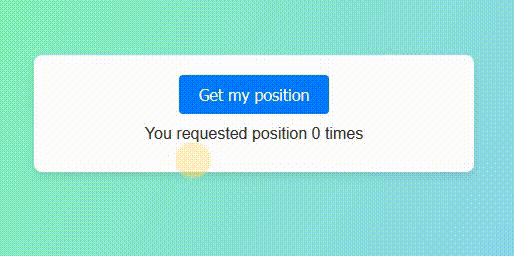

# React - Geolocation

# 🔗 [Live Preview](https://steady-caramel-c462c9.netlify.app/)

---

## About 👋

This React application demonstrates how to retrieve and display the user's geolocation using the `navigator.geolocation` API.

---

## Features 👨‍💻

-   Fetches the user's latitude and longitude upon button click.
-   Displays a loading message while the position is being retrieved.
-   Shows an error message if geolocation is not supported or an error occurs.
-   Provides a link to Open Street Map for easy visualization of the user's location.
-   Tracks the number of times the user requests their position.

---

## Languages

- React: functions, conditionals, useState, custom hook
- Styling: basic CSS
